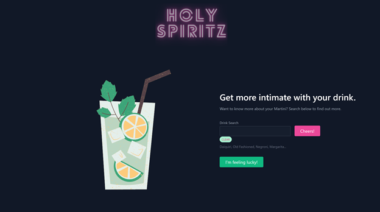
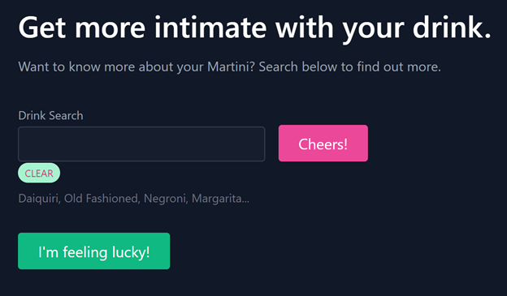
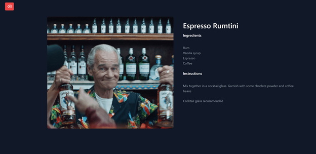
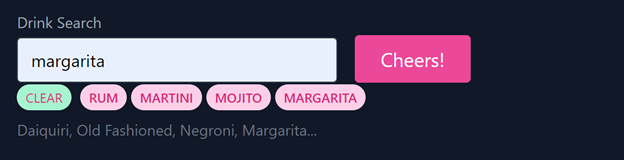

# Project_1_Group-B

Project 1 by Andrew, Leo, Rob and Jemima. 

# About the Project - Holy Spiritiz 
 
The Holy Spritiz Main Page allows users to search for cocktails of their choice to be presented with the ingredients, instruction, glass recommended to be used to serve the selected cocktail and a witty giph related to the cocktail. Users can also see a list of their recently searched drinks (up to 7 drinks). They can also search for a cocktail randomly selected for them. 

Below is an image of the Holy Spritiz main page. 



## APIs Used 
* TheCocktailDB
* GIPHY

## Contributors 
* Andrew Gavegan 
* Leo Wilson 
* Rob Saba 
* Jemima Siddiqui 

## Installation

### Viewing the homepage 


In order to access Holy Spiritz, navigate to the following link: 
 [Holy Spiritz page](https://jemimasiddiqui.github.io/Project_1_Group-B/). 

### Downloading Visual Studio Code 

 Download the latest version of Visual Studio to your local machine (Mac, Linux or Windows). Please use the following link to download the latest version of VS Code [Download VS Code](https://code.visualstudio.com/download). 

### Pulling the repository from Git 

If you would like to acess the source code (HTML, CSS and JavaScript files), please navigate to the following public Github repository [Github Repository](https://github.com/JemimaSiddiqui/Project_1_Group-B.git). 

* Clone the repository to your local desktop using the following steps:

  * 🔑 Use the terminal command `cd` to navigate to the directory where we want the repository located. In this case, we will save it to the Desktop. 

  ```bash
  cd Desktop
  ```

  * 🔑 Use the git command `git clone` followed by the URL copied from Github to clone the repo to our local machine.

  ```bash
  git clone <url>
  ```

  * 🔑 Use the `git clone` command creates a new directory with the same name as the repository. We navigate into our new directory using `cd`.

  ```bash
  cd Project_1_Group-B
  ```
* After the repository has been cloned to your local machine, open the HTML, CSS and JavaScript files using Visual Studio application. 

## Usage 

This section contains instructions on how to use the Work Day Scheduler Application. 

1. Application page: 

Below is an image of the Holy Spiritz main page. 


2. Input field, "Cheers!" and "I'm feeling lucky" Button:

A user can input the name of a cocktail of their choice and click "Cheers!" to see the ingredients and instructions used to make the cocktail. There is also a recommendation on the type of glass usually used for serving the cocktail and a witty giph corresponding to the drink.  

A user can also click on the "I'm feeling lucky" button to be presented with information related to a randomly selected drink. 



3. Ingredients, Instruction, Glass Recommendation and Giph:

Below is an image of the page presented to the user once the search a type of cocktail, which in this case is Rum. 



4. Search History: 

A user can also see their recently searched drinks (up to 7 drinks) which is located right below the input field. They may either clear it using the "Clear" button, or the list is cleared once the list reaches 7 drinks. 



## Credits

* This README.md file was created through the help of the following tutorial: [Professional README Guide](https://coding-boot-camp.github.io/full-stack/github/professional-readme-guide).


---
© 2022 Trilogy Education Services, LLC, a 2U, Inc. brand. Confidential and Proprietary. All Rights Reserved.

